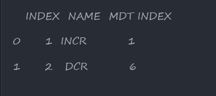
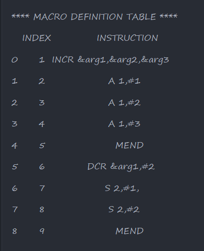

# MACRO-DEFINITION-AND-MACRO-NAME-TABLE

### This is code for creating MNT[Macro Name Table], MDT[Macro Definition Table], ALA[Arguement List Array] for given Instructions

## Instructions

**For now it does not support :-**

> Macro Inside Macro
> Label in front of Macro Name

# Here is how it Looks

##### Macro Name Table

##### Macro Definition Table

<table>
  <tr>
    <th>ALA TABLE PASS I</th>
    <th>ALA TABLE PASS II</th>
  </tr>
  <tr>
    <td>
      
    </td>
    <td>
      
    </td>
  </tr>
</table>
